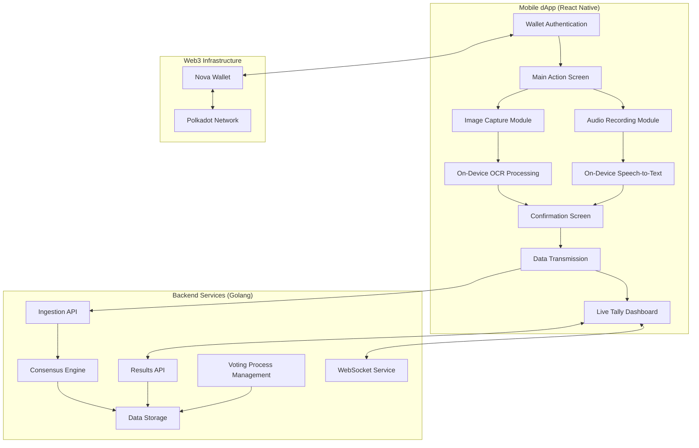

# Design Document

## Overview

OYAH! MVP is a decentralized mobile application that enables citizens and party agents to act as "witnesses" by securely submitting polling station results through Web3 technology. The system uses crowdsourced consensus for real-time verification and on-device processing for speed and resilience in low-connectivity environments.

The architecture follows a mobile-first approach with a React Native frontend and Golang backend, implementing the core user flow: **Connect → Capture → Confirm → Transmit → Tally**.

## Architecture

### High-Level Architecture



### Technology Stack

**Mobile Application:**
- **Framework:** React Native with TypeScript
- **Web3 Integration:** Polkadot.js API (`@polkadot/api`)
- **Wallet Connection:** Nova Wallet integration via `@polkadot/extension-dapp`
- **On-Device ML:** TensorFlow Lite for OCR and Speech-to-Text
- **State Management:** Zustand
- **Styling:** Styled Components
- **HTTP Client:** Axios for API communication

**Backend Services:**
- **Framework:** Golang with Gin framework
- **Data Storage:** In-memory storage (Redis for production)
- **API Design:** RESTful JSON APIs
- **Real-time Communication:** WebSocket for live updates
- **Consensus Algorithm:** Custom majority-based verification

**Infrastructure:**
- **Deployment:** Docker containers
- **Networking:** HTTPS with proper CORS configuration
- **Monitoring:** Structured logging with request tracing

## Components and Interfaces

### Mobile Application Components

#### 1. Wallet Authentication Module

**Purpose:** Secure connection to Nova Wallet for user identity verification

**Key Components:**
- `WalletConnector`: Manages Polkadot.js API initialization
- `NovaWalletBridge`: Handles Nova Wallet specific connection logic
- `AuthenticationState`: Zustand store for wallet connection state

**Implementation Details:**
```typescript
interface WalletState {
  isConnected: boolean;
  walletAddress: string | null;
  accounts: InjectedAccount[];
  selectedAccount: InjectedAccount | null;
}

interface WalletActions {
  connectWallet: () => Promise<void>;
  disconnectWallet: () => void;
  selectAccount: (account: InjectedAccount) => void;
}
```

**Integration Pattern:**
- Use `window.injectedWeb3` detection with retry mechanism
- Implement `window.walletExtension.isNovaWallet` flag checking
- Handle connection timeouts and user rejection gracefully

#### 2. Image Capture and OCR Module

**Purpose:** Capture Form 34A images and extract vote counts using on-device processing

**Key Components:**
- `CameraCapture`: Native camera interface for document scanning
- `OCRProcessor`: TensorFlow Lite model wrapper for text extraction
- `ImagePreprocessor`: Image optimization for better OCR accuracy

**TensorFlow Lite Integration:**
```typescript
interface OCRResult {
  extractedText: string;
  confidence: number;
  boundingBoxes: BoundingBox[];
  candidates: { [key: string]: number };
}

class OCRProcessor {
  private model: tf.GraphModel;
  
  async processImage(imageUri: string): Promise<OCRResult> {
    // Load and preprocess image
    const tensor = await this.preprocessImage(imageUri);
    
    // Run inference
    const predictions = await this.model.predict(tensor);
    
    // Post-process results
    return this.extractVoteCounts(predictions);
  }
}
```

**Model Specifications:**
- **Model:** MobileNet-based OCR model optimized for forms
- **Input Size:** 320x320 pixels
- **Output:** Text regions with confidence scores
- **Quantization:** Float16 for reduced model size

#### 3. Audio Recording and Speech-to-Text Module

**Purpose:** Record official announcements and extract vote counts using on-device processing

**Key Components:**
- `AudioRecorder`: Native audio recording interface
- `STTProcessor`: TensorFlow Lite speech-to-text model wrapper
- `AudioPreprocessor`: Audio normalization and noise reduction

**Implementation Pattern:**
```typescript
interface STTResult {
  transcription: string;
  confidence: number;
  extractedNumbers: { [key: string]: number };
}

class STTProcessor {
  private model: tf.GraphModel;
  
  async processAudio(audioUri: string): Promise<STTResult> {
    // Convert audio to required format
    const audioTensor = await this.preprocessAudio(audioUri);
    
    // Run speech-to-text inference
    const transcription = await this.model.predict(audioTensor);
    
    // Extract numerical values
    return this.parseVoteCounts(transcription);
  }
}
```

#### 4. Data Transmission Module

**Purpose:** Assemble and transmit verified polling results to backend

**Payload Structure:**
```typescript
interface PollingResultPayload {
  walletAddress: string;
  pollingStationId: string;
  gpsCoordinates: {
    latitude: number;
    longitude: number;
  };
  timestamp: string;
  results: {
    [candidateName: string]: number;
    spoilt: number;
  };
  submissionType: 'image_ocr' | 'audio_stt';
  confidence: number;
}
```

**Transmission Strategy:**
- Primary: Direct HTTPS POST to backend API
- Fallback: Local storage with retry mechanism
- Offline Support: Queue submissions for later transmission

#### 5. Live Tally Dashboard

**Purpose:** Display real-time polling results and verification status

**Key Components:**
- `TallyDisplay`: National-level aggregate results
- `StationList`: Individual polling station status
- `StatusIndicator`: Visual verification status (Pending/Verified)

**Real-time Updates:**
- Primary: WebSocket connection for instant updates
- Fallback: 30-second polling when WebSocket unavailable
- Automatic reconnection and synchronization
- Optimistic UI updates with error handling

### Backend Services Architecture

#### 1. Ingestion API Service

**Purpose:** Receive and validate polling result submissions

**Endpoint Design:**
```go
type SubmissionRequest struct {
    WalletAddress    string             `json:"walletAddress" binding:"required"`
    PollingStationID string             `json:"pollingStationId" binding:"required"`
    GPSCoordinates   GPSCoordinates     `json:"gpsCoordinates" binding:"required"`
    Timestamp        time.Time          `json:"timestamp" binding:"required"`
    Results          map[string]int     `json:"results" binding:"required"`
    SubmissionType   string             `json:"submissionType" binding:"required"`
    Confidence       float64            `json:"confidence"`
}

type GPSCoordinates struct {
    Latitude  float64 `json:"latitude"`
    Longitude float64 `json:"longitude"`
}
```

**Validation Rules:**
- Wallet address format validation
- GPS coordinates range validation
- Results numerical validation
- Timestamp freshness check (within 8 hours)
- Duplicate submission prevention

#### 2. Consensus Engine

**Purpose:** Implement crowdsourced verification algorithm

**Algorithm Design:**
```go
type ConsensusEngine struct {
    submissions map[string][]Submission
    threshold   int // Minimum submissions for consensus
}

func (ce *ConsensusEngine) ProcessSubmission(sub Submission) ConsensusResult {
    stationSubmissions := ce.submissions[sub.PollingStationID]
    
    // Group by identical results
    resultGroups := ce.groupByResults(stationSubmissions)
    
    // Find majority consensus
    for results, group := range resultGroups {
        if len(group) >= ce.threshold && ce.isMajority(group, stationSubmissions) {
            return ConsensusResult{
                Status: "Verified",
                Results: results,
                ConfidenceLevel: ce.calculateConfidence(group),
            }
        }
    }
    
    return ConsensusResult{Status: "Pending"}
}
```

**Consensus Rules:**
- **Minimum Threshold:** 3 unique wallet addresses
- **Majority Requirement:** >50% of submissions for that station
- **Exact Match:** Results must be identical (no tolerance for minor differences)
- **Wallet Uniqueness:** One submission per wallet per station (latest wins)

#### 3. Voting Process Management Service

**Purpose:** Create and manage voting processes with multiple polling stations

**Data Structures:**
```go
type VotingProcess struct {
    ID              string            `json:"id"`
    Title           string            `json:"title"`
    Position        string            `json:"position"`
    Candidates      []Candidate       `json:"candidates"`
    PollingStations []string          `json:"pollingStations"`
    Status          string            `json:"status"` // "Setup" | "Active" | "Complete"
    CreatedAt       time.Time         `json:"createdAt"`
    StartedAt       *time.Time        `json:"startedAt,omitempty"`
    CompletedAt     *time.Time        `json:"completedAt,omitempty"`
}

type Candidate struct {
    ID   string `json:"id"`
    Name string `json:"name"`
}
```

**API Endpoints:**
- `POST /api/v1/voting-process` - Create new voting process
- `PUT /api/v1/voting-process/{id}/start` - Start voting process
- `GET /api/v1/voting-process/{id}` - Get voting process details

#### 4. Results API Service

**Purpose:** Provide aggregated polling data for dashboard consumption

**Response Structure:**
```go
type TallyResponse struct {
    VotingProcess   VotingProcessInfo `json:"votingProcess"`
    AggregatedTally map[string]int    `json:"aggregatedTally"`
    PollingStations []StationStatus   `json:"pollingStations"`
    LastUpdated     time.Time         `json:"lastUpdated"`
}

type VotingProcessInfo struct {
    ID         string      `json:"id"`
    Title      string      `json:"title"`
    Position   string      `json:"position"`
    Candidates []Candidate `json:"candidates"`
    Status     string      `json:"status"`
}

type StationStatus struct {
    ID         string         `json:"id"`
    Status     string         `json:"status"` // "Pending" | "Verified"
    Results    map[string]int `json:"results,omitempty"`
    Confidence float64        `json:"confidence,omitempty"`
}
```

#### 5. WebSocket Service

**Purpose:** Provide real-time updates for dashboard synchronization

**Implementation:**
```go
type WebSocketHub struct {
    clients    map[*WebSocketClient]bool
    broadcast  chan []byte
    register   chan *WebSocketClient
    unregister chan *WebSocketClient
}

type TallyUpdate struct {
    Type            string        `json:"type"` // "tally_update"
    VotingProcessID string        `json:"votingProcessId"`
    Data            TallyResponse `json:"data"`
    Timestamp       time.Time     `json:"timestamp"`
}
```

**Features:**
- Real-time tally updates when consensus changes
- Client connection management
- Automatic reconnection support
- Fallback to HTTP polling when WebSocket unavailable

## Data Models

### Core Data Structures

#### Submission Model
```go
type Submission struct {
    ID               string            `json:"id"`
    WalletAddress    string            `json:"walletAddress"`
    PollingStationID string            `json:"pollingStationId"`
    GPSCoordinates   GPSCoordinates    `json:"gpsCoordinates"`
    Timestamp        time.Time         `json:"timestamp"`
    Results          map[string]int    `json:"results"`
    SubmissionType   string            `json:"submissionType"`
    Confidence       float64           `json:"confidence"`
    ProcessedAt      time.Time         `json:"processedAt"`
}
```

#### Polling Station Model
```go
type PollingStation struct {
    ID              string            `json:"id"`
    VotingProcessID string            `json:"votingProcessId"`
    Status          string            `json:"status"`
    VerifiedResults map[string]int    `json:"verifiedResults,omitempty"`
    Submissions     []Submission      `json:"submissions"`
    ConsensusReached time.Time        `json:"consensusReached,omitempty"`
    ConfidenceLevel float64           `json:"confidenceLevel"`
}
```

#### Voting Process Model
```go
type VotingProcess struct {
    ID              string            `json:"id"`
    Title           string            `json:"title"`
    Position        string            `json:"position"`
    Candidates      []Candidate       `json:"candidates"`
    PollingStations []string          `json:"pollingStations"`
    Status          string            `json:"status"`
    CreatedAt       time.Time         `json:"createdAt"`
    StartedAt       *time.Time        `json:"startedAt,omitempty"`
    CompletedAt     *time.Time        `json:"completedAt,omitempty"`
}
```

### Data Storage Strategy

**Development (MVP):**
- In-memory storage using Go maps with mutex protection
- JSON file persistence for data recovery
- Simple key-value structure for fast lookups

**Production Considerations:**
- Redis for high-performance caching
- PostgreSQL for persistent storage
- Data partitioning by polling station for scalability

## Error Handling

### Mobile Application Error Handling

#### Network Errors
```typescript
class APIClient {
  async submitResults(payload: PollingResultPayload): Promise<SubmissionResult> {
    try {
      const response = await axios.post('/api/v1/submitResult', payload);
      return { success: true, data: response.data };
    } catch (error) {
      if (error.code === 'NETWORK_ERROR') {
        // Store locally for retry
        await this.storeForRetry(payload);
        return { success: false, error: 'Network unavailable. Stored for retry.' };
      }
      throw error;
    }
  }
}
```

#### ML Processing Errors
- **OCR Failure:** Fallback to manual entry with guided input
- **STT Failure:** Fallback to manual entry with audio playback
- **Low Confidence:** Display warning and allow manual correction

#### Wallet Connection Errors
- **Connection Timeout:** Retry mechanism with exponential backoff
- **User Rejection:** Clear error message with retry option
- **Wallet Not Found:** Installation guidance and alternative options

### Backend Error Handling

#### API Error Responses
```go
type ErrorResponse struct {
    Error   string `json:"error"`
    Code    string `json:"code"`
    Details string `json:"details,omitempty"`
}

func handleValidationError(c *gin.Context, err error) {
    c.JSON(http.StatusBadRequest, ErrorResponse{
        Error:   "Validation failed",
        Code:    "VALIDATION_ERROR",
        Details: err.Error(),
    })
}
```

#### Consensus Engine Error Handling
- **Insufficient Data:** Return pending status with required threshold info
- **Conflicting Results:** Log for manual review, maintain pending status
- **System Errors:** Graceful degradation with error logging

## Testing Strategy

### Mobile Application Testing

#### Unit Testing
- **ML Processing:** Mock TensorFlow Lite models with predictable outputs
- **State Management:** Test Zustand store actions and state transitions
- **API Client:** Mock HTTP responses for various scenarios

#### Integration Testing
- **Wallet Integration:** Test with Nova Wallet testnet
- **Camera/Audio:** Test on physical devices with various input qualities
- **End-to-End Flow:** Complete user journey from capture to submission

#### Testing Tools
- **Jest:** Unit testing framework
- **React Native Testing Library:** Component testing
- **Detox:** End-to-end testing on devices

### Backend Testing

#### Unit Testing
```go
func TestConsensusEngine_ProcessSubmission(t *testing.T) {
    engine := NewConsensusEngine(3) // threshold of 3
    
    // Add submissions with identical results
    for i := 0; i < 3; i++ {
        submission := createTestSubmission(fmt.Sprintf("wallet%d", i))
        result := engine.ProcessSubmission(submission)
        
        if i < 2 {
            assert.Equal(t, "Pending", result.Status)
        } else {
            assert.Equal(t, "Verified", result.Status)
        }
    }
}
```

#### API Testing
- **Gin Test Framework:** HTTP endpoint testing
- **Test Database:** In-memory storage for isolated tests
- **Load Testing:** Concurrent submission handling

#### Performance Testing
- **Consensus Algorithm:** Test with large numbers of submissions
- **API Throughput:** Measure requests per second under load
- **Memory Usage:** Monitor for memory leaks in long-running processes

### Security Testing

#### Mobile Security
- **Wallet Integration:** Test for private key exposure
- **Data Transmission:** Verify HTTPS enforcement
- **Local Storage:** Test for sensitive data encryption

#### Backend Security
- **Input Validation:** Test for injection attacks
- **Rate Limiting:** Test for DoS protection
- **Authentication:** Verify wallet signature validation

This design provides a comprehensive foundation for implementing the OYAH! MVP while maintaining security, performance, and user experience standards. The modular architecture allows for incremental development and future enhancements.